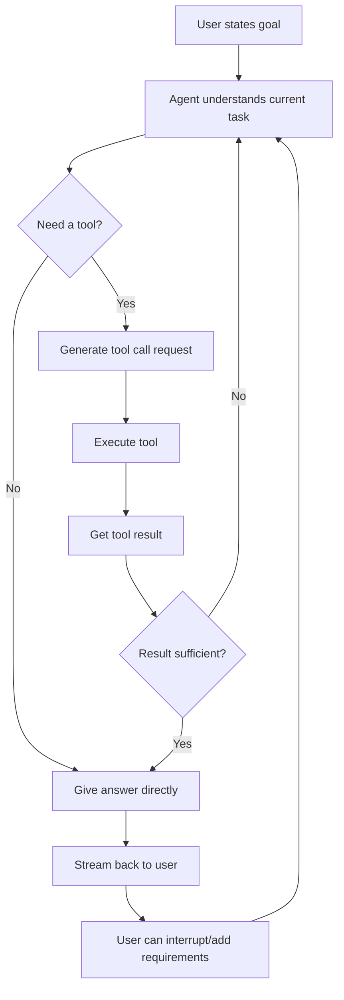
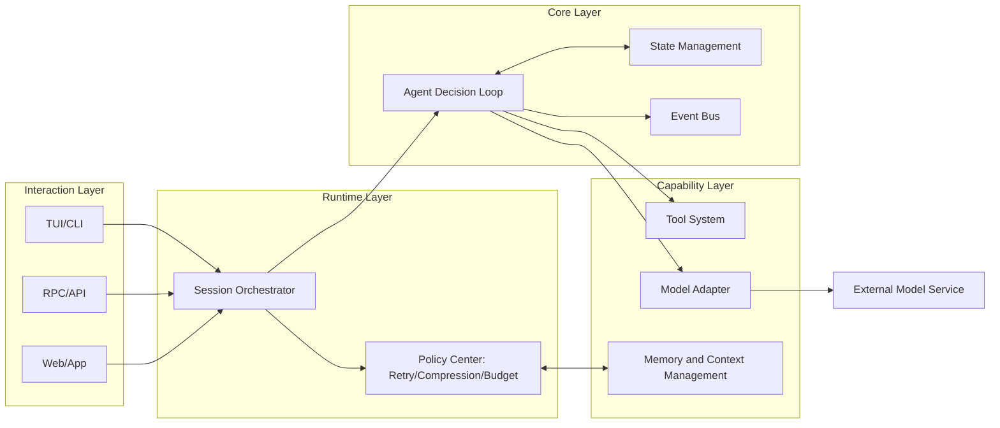
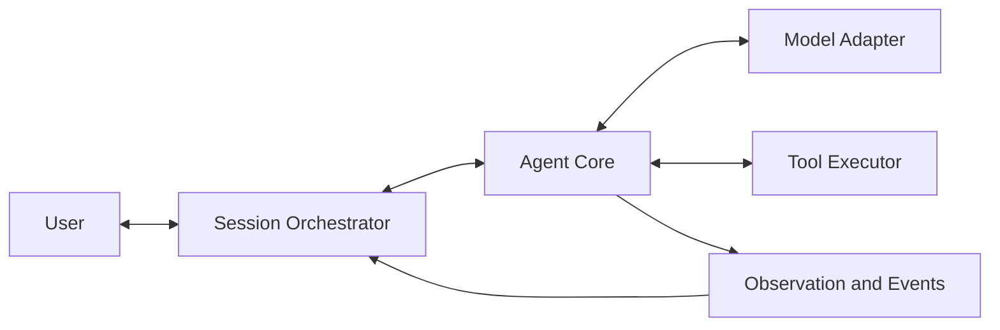
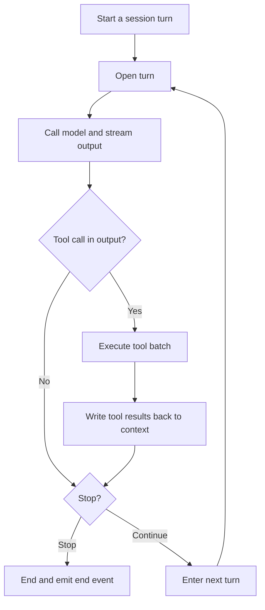
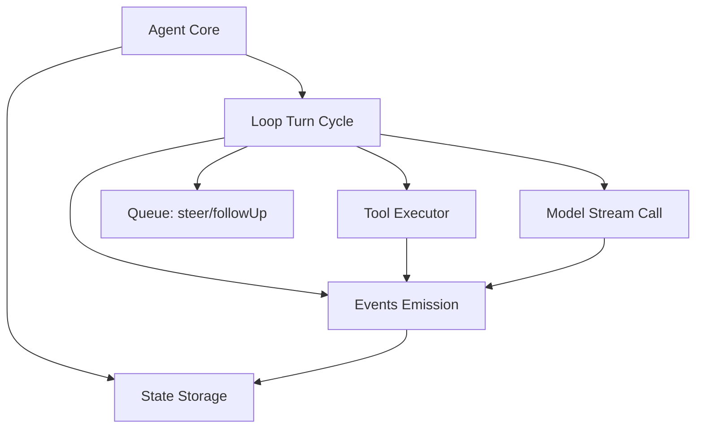

AI Agents will most likely be the paradigm for future AI software design, so for most developers and non-technical people just getting into vibe coding, understanding how they're designed and the principles behind them will help you design next-generation application software more effectively.

This post tries to use plain language to help you understand what an AI Agent is, what problems it solves, and which protocols and tools will come into play as part of that infrastructure.

Target audience:

- Vibe coders (rapid prototyping, build and iterate)
- Programmers
- Non-technical users just starting to code

---

## First Principles: What Problems Does an Agent Framework Actually Solve?

### Models are powerful, but unreliable

Large Language Models (LLMs) "guess"; they don't "guarantee."
So you can't treat them as deterministic programs (same input always produces same output).

Problems to solve:

- How to bring unstable output into a controllable flow
- How to know where the failure is when something breaks

### Real-world task results are usually not simple answers, but complete workflow outputs

Real tasks typically involve:

- Read information
- Make decisions
- Call tools
- Continue deciding based on tool results
- Ultimately produce documents, code, or other artifacts

This means an Agent's design goal isn't limited to "question and answer," but is a "cyclic decision system."

### Users don't want to wait until the end to see results

When interacting with AI, users typically want:

- Visible process (streaming)
- Ability to interrupt (abort the current task)
- Ability to add instructions mid-task (steer, guide while executing)

So the system must natively support real-time interaction, not one-shot black-box execution.

### Context keeps growing, costs keep growing

The longer the conversation, the larger the input, the slower the speed, the higher the cost, and it may even exceed limits.
There must be a mechanism to "compress history while preserving key information."

### One core serving multiple interaction modes

The same Agent must run on:

- Terminal UI (TUI)
- Remote Procedure Call (RPC)
- Future Web or App interfaces

So the "intelligent core" and "presentation layer" must be decoupled (independent, not bound together).

---

## From Problems to Requirements, Then to Design

### Requirements Checklist

A usable Agent framework must at minimum satisfy:

1. Looping: supports "think → call tool → think again"
2. Observable: every step is visible to UI or logging
3. Controllable: can pause, cancel, interrupt, resume
4. Recoverable: retry on failure, can continue from the last session
5. Extensible: add new tools, new models, new frontends
6. Governable: clear boundaries on cost, context, and permissions

### End-to-End Flowchart

Going from problems to requirements, and requirements to design, we get the following flowchart:

This diagram expresses:

- An Agent is a closed-loop system, not a single function call.
- "Tools" are capability amplifiers, not accessories.
- **The user is in the loop, not outside it.**

### Overall Architecture Diagram

### Component Diagram (Understanding "Who Owns What")

Responsibility split:

- Session Orchestrator: handles user input, session state, retry and compression policies.
- Agent Core: only does the "thinking loop" and "state advancement."
- Model Adapter: shields differences between model providers.
- Tool Executor: uniformly executes local or remote tools.
- Observation and Events: turns the process into visible signals for UI/log systems.

---

## To Land These Designs, What Protocols and Foundational Patterns Are Required?

This section is the "minimum necessities" to complete the design above. We need to consider which engineering practices to introduce from a protocols and design-patterns standpoint. (Like building a skyscraper, you need to define the materials, the common engineering designs you can reuse, and how to make the structure mechanically stand the test of time.)

Most of these protocols are currently designed and implemented by developers on demand, but standards will likely emerge in the near future.

### Required Protocols (Skipping Any Causes Loss of Control)

1. Message Protocol
- Unifies how user messages, assistant messages, and tool results are described.

2. Event Protocol
- Unifies how start, update, end, error, and tool execution status are described.
- Purpose: lets UI and logs see the "process," not just the "outcome."

3. Tool Contract
- Tool name, parameter structure (Schema), and execution return format must be fixed.

4. Streaming Contract
- Supports incremental output (delta) to guarantee real-time user feedback.

5. Cancellation Contract
- Any link in the chain should respond to abort signals, avoiding "can't stop."

6. Error Contract
- Failures must be structured (machine-processable), not just string error messages.

### Foundational Design Patterns to Understand

For readers without programming experience, you'll need to learn about these basic programming design patterns from other sources first.

1. State Machine
- An Agent has state transitions at every step (e.g., waiting for input → generating output → tool execution → back to generating).

2. Publish/Subscribe (Pub/Sub)
- Core emits events, UI/logs subscribe to events.
- Benefit: core logic doesn't depend on specific interfaces.

3. Adapter
- Wraps different model interfaces into a unified calling convention.

4. Strategy
- Retry strategies, tool concurrency strategies, compression strategies are interchangeable.

5. Pipeline
- Input preprocessing → model call → tool execution → post-processing is a pluggable chain.

6. Idempotency and Recoverability
- Repeating the same operation should not produce catastrophic side effects; failure should be recoverable.

---

## Case Study: PI Agent's Design Philosophy and Architecture

The above covers "general Agent framework design." Now let's ground it in the recently popular minimalist framework [PI Agent](https://github.com/earendil-works/pi).

Let's look at how this framework designs an Agent.

### Design Philosophy

1. Minimal Core
- Core only handles the loop, state, events, and tool orchestration.

2. Pluggable Periphery
- Models, tools, retries, and context handling are all replaceable.

3. Process Over Outcome
- First ensure the process is visible and controllable, then pursue "smart output."

4. Session Over Request
- Treat the Agent as a long-term session system, not a single API call.

### Agent Core Logic Flowchart

### Agent Core Component Diagram

The value of this structure:

- The interaction layer only sees events, doesn't touch core state.
- Model replacement doesn't change the loop skeleton.
- Tool extension doesn't break the core control flow.

---

## Summary

Agent architecture isn't "making the model smarter"—it's "making an uncertain model work reliably inside a controllable system."

You can remember it as this formula:

$$
  \text{Usable Agent} = \text{Model Capability} \times \text{Engineering Control Capability}
$$

Where engineering control capability mainly comes from:

- Loop design
- Protocol design
- Event observability
- Recoverability and extensibility

Judging by current trends, this will very likely be the foundational paradigm for the next generation of application software.
