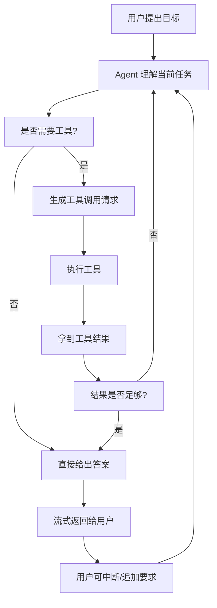
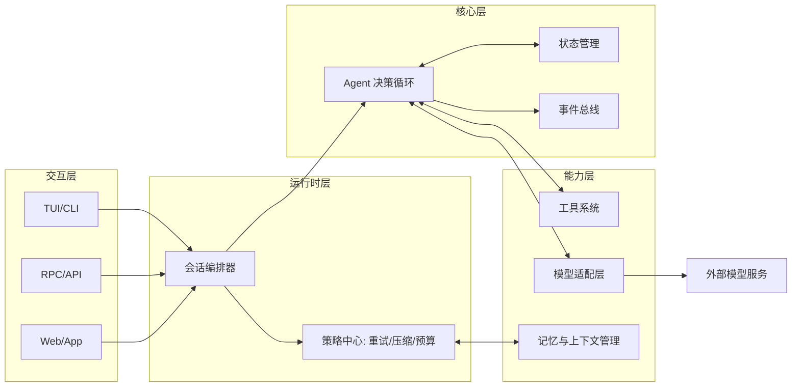
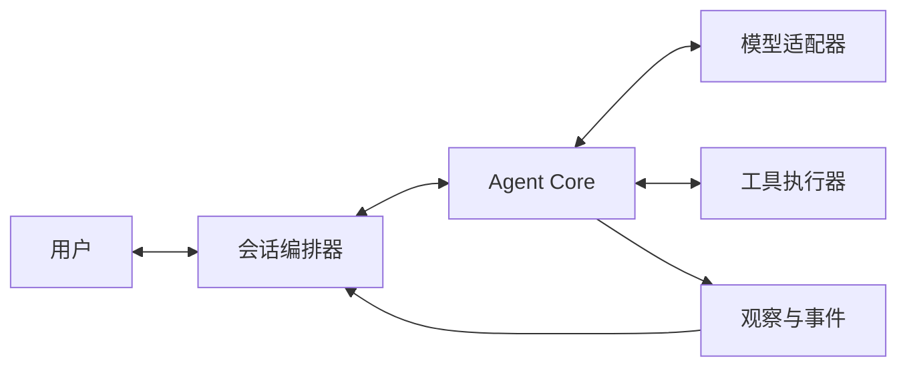
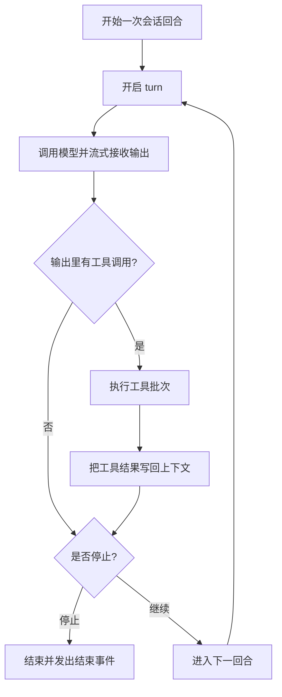
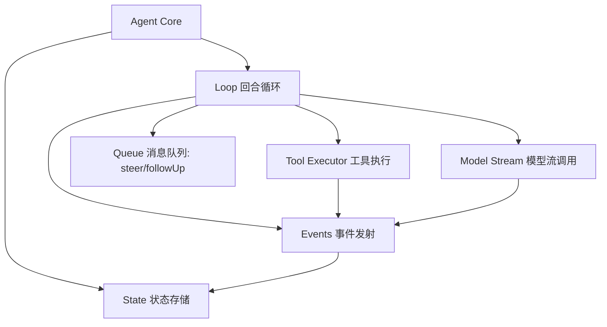

AI 智能体（Agent）很有可能是未来AI软件设计的范式，所以对于大部分开发者、刚接触 vibe coding 的非技术人员，了解它的设计方式和背后的原理，就能在未来设计新时代的应用软件时更得心应手。

本文试图用通俗易懂的语言，让你理解什么是 AI Agent，它解决了什么问题，以它为基础设施，有哪些协议和工具将在未来派上用场。

本文目标读者：

- Vibe coding 人群（快速做原型、边做边改）
- 程序员
- 刚接触编程的非技术用户

---

## 从第一性原理出发：Agent 框架到底在解决什么问题

### 模型很强，但不可靠

大模型（LLM）会“猜”，不会“保证”。
所以你不能把它当确定性程序（同样输入一定同样输出）。

需要解决的问题：

- 如何让不稳定输出进入可控流程
- 如何在失败时知道失败在哪里

### 现实中的任务结果往往不是一个简单的答复，而是一个完整的流程产出物

真实任务往往是：

- 读信息
- 做决策
- 调用工具
- 根据工具结果继续决策
- 最终产出文档、代码或者其他

这意味着 Agent 的设计目标不仅局限在“一问一答”，而是一套“循环决策系统”。

### 用户不想等到最后才看到结果

在和AI交互过程中，用户通常希望：

- 过程可见（streaming，流式显示）
- 可以打断（abort，中止当前任务）
- 可以中途追加指令（steer，在执行任务过程中给予引导）

所以系统必须天然支持实时交互，而不是一次性黑盒执行。

### 上下文会越来越大，成本会越来越高

对话越长，输入越大，速度越慢，费用越高，甚至会超限。
必须有“压缩历史、保留关键信息”的机制。

### 一个内核要服务多种交互方式

同一个 Agent 要能跑在：

- 终端界面（TUI，Terminal UI，终端交互界面）
- 远程调用（RPC，Remote Procedure Call，远程过程调用）
- 未来可能的 Web 或 App

所以"智能内核"和"界面层"必须解耦（彼此独立，不绑死）。

---

## 从问题到需求，再到设计

### 需求清单

一个可用 Agent 框架至少要满足：

1. 可循环：支持“思考 -> 调工具 -> 再思考”
2. 可观察：每一步都能被 UI 或日志系统看到
3. 可控制：能暂停、取消、插队、续跑
4. 可恢复：失败后可重试，可继续上一次会话
5. 可扩展：能加新工具、新模型、新前端
6. 可治理：对成本、上下文、权限有边界

### 端到端流程图

以问题驱动需求，需求驱动设计的方式，我们就可以得出下面的流程图：

这个图表达的是：

- Agent 是闭环系统，不是单次函数。
- “工具”是能力放大器，不是附属品。
- **用户在回路内，而不是回路外**。

### 整体架构图

### 组件图（理解“谁负责什么”）

职责拆分：

- 会话编排器：处理用户输入、会话状态、重试和压缩策略。
- Agent Core：只做“思考循环”和“状态推进”。
- 模型适配器：屏蔽不同模型供应商差异。
- 工具执行器：统一执行本地或远程工具。
- 观察与事件：把过程变成可见信号给 UI/日志系统。

---

## 落地这些设计，必备协议和基础设计模式是什么

这一节是完成上面设计的“最小必需品”。需要从协议、设计模式角度考虑引入哪些工程实践。（好比盖摩天大楼，需要先定义好用什么材料、哪些通用的工程设计可以拿来就用、如何让建筑结构从力学上经得起时间验证）。

这些协议目前大部分由开发者按需设计实现，但是在不远的未来，很可能逐个出现标准规范。

### 必备协议（不全就会失控）

1. 消息协议（Message Protocol）
- 统一描述用户消息、助手消息、工具结果。

2. 事件协议（Event Protocol）
- 统一描述开始、更新、结束、错误、工具执行状态。
- 目的：让 UI 和日志看到“过程”，不是只看到“结论”。

3. 工具协议（Tool Contract）
- 工具名、参数结构（Schema，字段规则）、执行返回格式必须固定。

4. 流式协议（Streaming Contract）
- 支持增量输出（delta，分段输出），保证用户实时反馈。

5. 取消协议（Cancellation Contract）
- 任意环节都应响应中止信号，避免“停不下来”。

6. 错误协议（Error Contract）
- 失败必须结构化（可机器处理），不能只靠字符串报错。

### 需要理解的基础设计模式

对于没有编程经验的读者，下面的一些编程基础设计模式，需要你先从其他资料中理解。

1. 状态机（State Machine）
- Agent 每一步都有状态转移（例如：等待输入 -> 生成输出 -> 工具执行 -> 回到生成）。

2. 发布-订阅（Pub/Sub，发布与订阅）
- Core 发事件，UI/日志订阅事件。
- 好处：核心逻辑不依赖具体界面。

3. 适配器（Adapter）
- 把不同模型接口包装成统一调用方式。

4. 策略模式（Strategy）
- 重试策略、工具并发策略、压缩策略可替换。

5. 管道与过滤（Pipeline）
- 输入预处理 -> 模型调用 -> 工具执行 -> 后处理，是可插拔链路。

6. 幂等与可恢复（Idempotency/Recoverability）
- 同一操作重复执行不应产生灾难性副作用，失败后能恢复。

---

## 以 PI Agent 为例：设计理念与架构

前面是“通用 Agent 框架设计”。现在落到最近很火的极简框架 [PI Agent](https://github.com/earendil-works/pi) 。

一起来看看这个框架是如何设计 Agent 的。

### 设计理念

1. 内核最小化
- Core 只负责循环、状态、事件、工具编排。

2. 外围可插拔
- 模型、工具、重试、上下文处理都可替换。

3. 过程优先于结果
- 先保证过程可见、可控，再追求“聪明输出”。

4. 会话优先于请求
- 把 Agent 当长期会话系统，不当单次 API 调用。

### Agent Core 逻辑流程图

### Agent Core 组件关系图

这个结构的价值是：

- 交互层只看事件，不碰核心状态。
- 模型替换不会改循环骨架。
- 工具扩展不会破坏核心控制流。

---

## 小结

Agent 架构不是“让模型更聪明”，而是“让不确定的模型在可控系统里稳定工作”。

你可以把它记成这个公式：

$$
  \text{可用 Agent} = \text{模型能力} \times \text{工程控制能力}
$$

其中工程控制能力主要来自：

- 循环设计
- 协议设计
- 事件可观察性
- 可恢复与可扩展性

从目前的趋势看，这大概率将是下一代应用软件的基础范式。